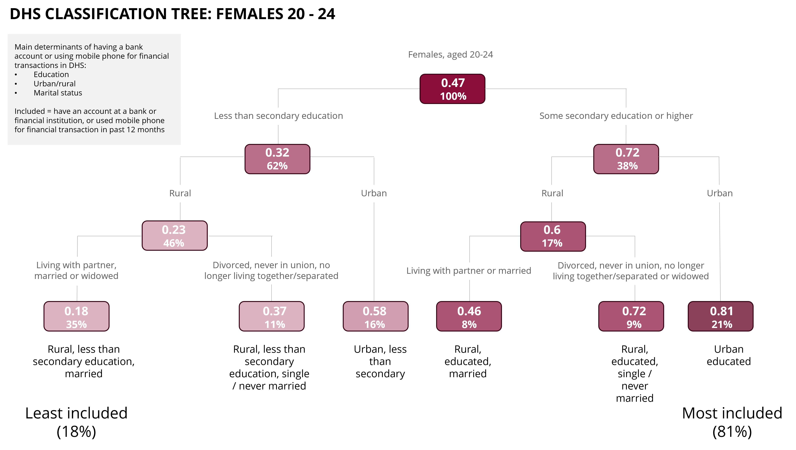

## Introduction

Decision tree learning is a supervised learning approach used in statistics and machine learning. Supervised learning approaches have a dependent variable (often called "labels" in machine learning circles) whereas unsupervised learning approaches do not have a dependent variable which the model attempts to predict. The independent variables are used to predict the value of the dependent variable. Notice this subtle but very important distinction between machine learning (ML) and econometrics – econometrics attempts to explain, ML attempts to predict. 

Regression (when the dependent variable is continuous) or classification (when the dependent variable is discrete) trees work as follows:
  
  1. Consider all possible binary splits in the data (i.e. all splits that divides the data into two groups)
  2. Calculate the goodness of fit of the data according to each possible split and select the split with the best goodness of fit
  3. Check whether the stopping criteria is met and only continue to the next step if it is not met
  4. Perform the split that has the best goodness of fit
  5. Within the resulting groups that the data has been partitioned into, start again from step 1

From point 5 it is easy to see why these algorithms are referred to as recursive partitioning. Hence the name of the R-package used to estimate decision trees – `rpart`.

One downside of using regression trees is that they are unstable and highly variable across different samples. This is especially true for "deep" trees (those that have many decision/splitting nodes).

### Example of a regression tree

Below is an example of regression tree output that was prepared (by Jess Smith) for a client slide in PowerPoint. 




## Estimating regression trees in R

After having developed a surface-level understanding of decision trees, it is time to explore the practicalities of estimating decision trees in R.

As mentioned above the R-package used to estimate regression/classification trees is `rpart`. The function in `rpart` that used to estimated the decision tree shares the name of the package: `rpart::rpart()`. `formula` and `data` are the two main arguments that the function requires. 

The formula should be specified as `dependent_variable ~ independer_var1 + independent_var_2 + ...`. A shorthand way of doing this is `dependent_variable ~ .` which means all variables in the data (except for the dependent variable) will be used as independent variables. `rpart()` accommodates for weighted data by allowing the user to specify the weights in the `weights` argument. 

The more technical arguments of the `rpart()` function are `method` and `control`. `method` specifies the method that the algorithm uses to evaluate the splits that it considers. A discussion of the technical aspects of each method is beyond the scope of this document, but `rpart()` "tries to make an intelligent guess" as to which method it should use. The options are "anova", "poisson", "class" and "exp" (feel free to google and find out more). Anova uses R-square as its goodness of fit evaluation for example.

`control` is arguably more important, especially when it's necessary to adjust the depth of a tree. The `control` argument provides stopping criteria which, as the name suggests, causes the algorithm to stop considering additional splits once the criteria are satisfied. You can run `?rpart.control` in the console for more information regarding the different options and their meanings. The default values here are important as they will determine how many splits the final tree will consist of. The most popular stopping criterion is referred to as `cp` which stands for complexity parameter. Depending on the `method` specified, the complexity parameter causes the algorithm to only perform splits until an additional split would fail to improve the fit of the model by more than `cp`. For the "anova" method the goodness of fit parameter is R-squared, meaning that if the additional split does not improve R-square by more than `cp` the split is not performed.

Below is a generalised example of how to estimate a regression tree (`dependent` is a continuous variable) with weighted data. Note how `data` does not contain the weights and that `weights` contains only the weights. 

```{r}
#| eval: false

library(rpart)

rpart(
    dependent ~ .,
    data = regression_data %>% select(-weight),
    method = "anova",
    weights = regression_data$weight,
    control = list(max_depth = 4, cp = 0.009)
  )

```

## Practical example

This practical example uses passenger data from the Titanic's maiden voyage. It is usually a good idea to perform exploratory data analysis before estimating any model. This will give a good sense of what the trends in the data are and what is expected from the model. 

```{r}
library(rpart)
library(readxl)
library(tidyverse)

titanic <- read_xlsx("data/Titanic.xlsx")

titanic

```

This section assumes that the EDA has already taken place and that all the variables in the dataset have been identified as important (excluding name and home.dest). The `survived` variable serves as the dependent variable. 

It is good practice to get the data into a format where the estimation can be done in a similar way as demonstrated in the previous section. There are no weights in the data, but we can create our own weights. Grouping by all the variables in the dataset, the weight is just the number of rows with those exact values in all fields of the data.  

```{r}

regression_data <- titanic %>% 
  select(-c(name, home.dest, ticket, cabin)) %>% 
  group_by_all() %>% 
  summarise(
    weight = n()
  ) %>% 
  arrange(-weight)

regression_data
```

The regression tree is estimated below and the summarised output displayed. It is quite cluttered. It would be better if we could visualise the output in a way similar to the slide above. 

```{r}
titanic_tree <- rpart(
    survived ~ .,
    data = regression_data %>% select(-weight),
    method = "anova",
    weights = regression_data$weight,
    control = list(max_depth = 4, cp = 0.01)
  )

titanic_tree

```


The output can be visualised using a package called `rpart.plot` with a function that shares the name. It is recommended to tweak the `tweak` argument which adjusts the size of the shapes and the text. The `main` is used to add a title to the plot.   

```{r}

library(rpart.plot)

rpart.plot(
    titanic_tree,
    tweak = 1.2,
    type = 4,
    main = "Titanic survivor tree"
  )

```

This chart is obviously not as pretty as the one that Jess Smith created, but it does communicate the message of the estimated model. Each shape is called a node. Nodes at the bottom are called leaf nodes whilst the other nodes are called decision nodes. Each node indicates the percentage of the sample that the node represents at the bottom and of the node and the predicted value for the group that the node represents at the top. 

The most important split in the data (which is dependent on the method chosen) is between male and females. Females were almost four times more likely to survive. The leaf node on the far left represents males 9.5 years and older whose class were 2 or higher. Based on the prediction of 0.13 from the regression, we can say that only 13% of those in this group survived. 


